# Bank API - REST API банковского сервиса

 

## О проекте
Это backend-проект на Go, который позволяет осуществлять отдельные банковские операции.
 
Реализованы регистрация пользователей, создание и работа с счетами в рублях, выпуск банковских (виртуальных) карт, платежи при помощи карт, переводы между счетами, получение кредитов с расчётом графиков платежей, аналитика по операциям. Добавлены интеграция с SOAP-API ЦБ РФ для получения ключевой ставки при создании кредита и отправка уведомлений об операциях по SMTP. Дополнительно реализованы возможность включения и отключения двухфакторной аутентификации (по OTP) для отдельных операций и API для администратора (вывод списка пользователей, блокировка пользователей).
 
Сервис написан на Go 1.26.3, в качестве СУБД используется PostgreSQL 17. Схема базы данных создаётся автоматически при запуске приложения при помощи SQL-файла в папке migrations.

## Возможности сервиса
- Регистрация пользователя с проверкой уникальности имени и email.
- Вход по email и паролю с выдачей JWT-токена (срок действия задаётся в конфигурации, по умолчанию 24 часа).
- Двухфакторная аутентификация. Настройка осуществляется через отдельные эндпоинты 2FA. При включённой 2FA для перевода, оплаты картой и ручного платежа по кредиту требуется одноразовый код.
- Создание банковских счетов только в валюте RUB, просмотр списка счетов и отдельного счёта, пополнение и списание по счетам.
- Переводы между счетами с проверками и валидациями.
- Выпуск банковской карты к счёту. Номер создаётся по алгоритму Луна; в базе хранятся зашифрованные реквизиты (PGP), HMAC используется для контроля целостности номера, CVV хранится в виде bcrypt-хэша. Есть возможность просмотра списка карт (номера маскируются) и полных данных отдельной карты (с расшифровкой реквизитов) владельцем. Реализована оплата с карты со списанием с привязанного счёта.
- Оформление кредита на счёт с расчётом аннуитетных платежей. Процентная ставка рассчитывается на основе ключевой ставки ЦБ РФ, дополнительно добавляется маржа банка из конфигурации (по умолчанию 2%). Формируется график отдельных платежей по кредиту с правильными датами оплаты.
- Есть возможность ручной оплаты ближайшего платежа по графику и затем следующих платежей.
- Реализована фоновая задача (выполняется каждые 12 часов), которая обрабатывает просроченные платежи. При недостатке средств для погашения очередного платежа начисляется штраф 10% от суммы платежа.
- Отправка email-уведомлений по SMTP при оплате картой, переводе со счёта и платежах по кредиту. В Docker Compose добавлен  эмулятор Mailpit для проверки с готовыми настройками.
- Реализована аналитика по счетам. Доходы и расходы за календарный месяц по всем счетам и по одному счёту; текущая кредитная нагрузка; сводные отчёты; прогноз остатка на срок до 365 дней с учётом будущих списаний по кредитам.
- Первый администратор назначается через специальный эндпоинт (при условии, что других администраторов ещё нет). Администратор может просматривать список пользователей, блокировать и разблокировать отдельных пользователей. После блокировки пользователь не может пользоваться сервисом.

 

## Используемые инструменты и библиотеки
1) Go 1.26.3
2) gorilla/mux - для маршрутизации HTTP
3) database/sql и github.com/lib/pq - драйвер PostgreSQL
4) github.com/golang-jwt/jwt/v5 - операции с JWT
5) github.com/sirupsen/logrus - логирование
6) github.com/spf13/viper - конфигурация из файла и переменных окружения
7) github.com/go-playground/validator/v10 - валидация DTO
8) github.com/beevik/etree - разбор XML ответа ЦБ РФ
9) github.com/wneessen/go-mail - отправка почты по SMTP
10) github.com/go-co-op/gocron/v2 - для фонового планировщика
11) github.com/pquerna/otp - TOTP для 2FA
12) github.com/ProtonMail/gopenpgp/v3 - шифрование данных карт
13) golang.org/x/crypto - bcrypt
14) Docker и Docker Compose - для контейнеризации

 

## Структура проекта
Проект разделён на слои: модели, репозитории, сервисы, HTTP-обработчики
 

1) cmd/api - точка входа, инициализация конфигурации, подключение к БД, выполнение SQL-миграций, настройка PGP-ключей, маршрутизатора, планировщика и HTTP-сервера
2) internal/config - загрузка настроек
3) internal/model - сущности, соответствующие таблицам БД
4) internal/repository - SQL-запросы и транзакции
5) internal/service - основная логика работы сервиса и интеграции (ЦБ, почта)
6) internal/handler - разбор запросов, вызов сервисов, формирование ответов
7) internal/middleware - JWT, логирование, восстановление после паники, проверка роли администратора
8) internal/dto - структуры запросов и ответов API
9) internal/security - PGP, HMAC, хэширование
10) internal/scheduler - фоновый планировщик для обработки просроченных платежей по кредитам
11) internal/errors, internal/validator - вспомогательные пакеты

 
Код в файлах во всём проекте подробно задокументирован.

## База данных
Файл миграции: migrations/001_init.up.sql. При старте приложения он выполняется целиком. Создаются таблицы:
1) users - данные пользователя: id, имя, email, хэш пароля, параметры 2FA, статус блокировки, роль и др.
2) accounts - данные по счетам: id, баланс, валюта (RUB) и др.
3) cards - привязка к счёту и пользователю, зашифрованные данные карт и др.
4) transactions - история операций
5) credits - параметры кредитов
6) payment_schedules - графики платежей по кредитам

 

## Конфигурация приложения
Основные параметры задаются в configs/config.yaml и переопределяются переменными окружения.
 

Ключевые параметры:
1) jwt.secret (JWT_SECRET), jwt.ttl - ключ JWT и время жизни токенов
2) encryption.pgp_passphrase (PGP_PASSPHRASE), encryption.hmac_secret (HMAC_SECRET) - пароль для ключей PGP и секретный ключ HMAC; при необходимости можно явно указать encryption.pgp_public_key и encryption.pgp_private_key
3) smtp.host, smtp.port, smtp.user, smtp.password - параметры SMTP (в Docker Compose настроены под Mailpit)
4) cbr.margin - банковская маржа в дополнение к ставке, полученной от ЦБ (в процентах годовых)
5) log.level (LOG_LEVEL) - уровень логирования logrus

 

## Запуск проекта
Для запуска проекта нужны Docker и Docker Compose.

1. Клонируйте репозиторий и перейдите в корневую папку.
2. Выполните команду docker compose up --build

Будут запущены приложение с API (порт 8080), PostgreSQL (порт 5432), Mailpit (SMTP на 1025, веб-интерфейс на 8025). Сгенерированные PGP-ключи для банковсих карт сохраняются в отдельном volume, чтобы после перезапуска контейнера расшифровка ранее созданных карт продолжала работать.
 
API доступен по адресу http://localhost:8080.

## Проверка интеграций
Почта. Откройте http://localhost:8025 - веб-интерфейс Mailpit. После операций, которые сопровождаются отправкой письма-уведомления (оплата картой, перевод, платёж по кредиту), письмо появится в списке слева.
Демонстрация:
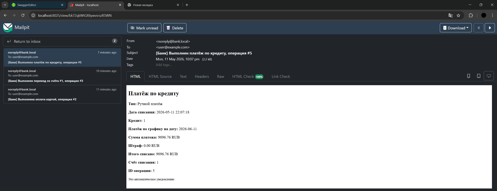
 
ЦБ РФ. При оформлении кредита в ответе API в поле interest_rate передаётся ставка с учётом данных ЦБ (при создании проекта 14.5%) и маржи из конфигурации (2% по умолчанию). При временной недоступности сервиса ЦБ используется последнее успешно полученное значение, если оно есть, иначе ставка по умолчанию, равная 20%.
Демонстрация:
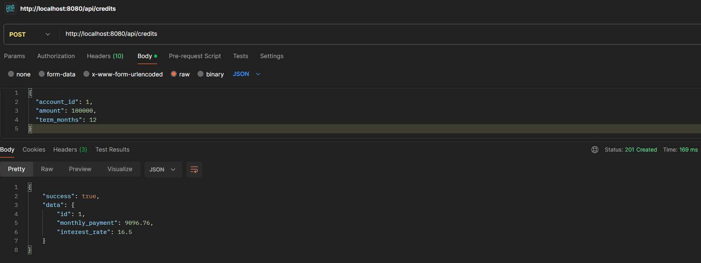

## Описание API
Полная спецификация с моделями запросов и ответов приведена в файле openapi.yaml.
 
Базовый адрес: http://localhost:8080
 
Префикс эндпоинтов: /api
 
Формат успешного ответа: JSON-объект { "success": true, "data": ... } (поле error отсутствует).
 
Формат ошибки: { "success": false, "error": "текст ошибки" } (поле data отсутствует).
 
Для авторизации после логина или регистрации полученный JWT-токен передаётся в заголовке Authorization: Bearer токен.

### Основные эндпоинты и примеры запросов

#### Публичные
Регистрация и вход (без токена)
- POST /api/register - создание пользователя. Пример тела:
{ "username": "user1", "email": "user@example.com", "password": "pass123word" }
- POST /api/login - вход. Пример тела:
{ "email": "user@example.com", "password": "pass123word" }
Если включена 2FA, дополнительно передаётся "otp_code": "123456". В ответе поле data.token - токен.

#### Защищённые (требуется токен)
Двухфакторная аутентификация
- POST /api/2fa/setup - получить секрет и QR-код в формате base64 для настройки TOTP.
- POST /api/2fa/enable - включить 2FA. Тело: { "code": "123456" }
- POST /api/2fa/disable - отключить 2FA. Тело: { "code": "123456" }

Назначение администратора
- POST /api/admin/bootstrap - назначить текущего пользователя администратором, если ни одного администратора ещё нет.

Операции со счетами
- POST /api/accounts - создать счёт. Тело: { "currency": "RUB" }
- GET /api/accounts - список счетов
- GET /api/accounts/1 - данные счёта
- POST /api/accounts/1/deposit - пополнить. Тело: { "amount": 1000.50 }
- POST /api/accounts/1/withdraw - списать. Тело: { "amount": 200.00 }
- GET /api/accounts/1/income-expense?year_month=2026-05 - доходы/расходы по счёту за месяц
- GET /api/accounts/1/credit-load - кредитная нагрузка по счёту
- GET /api/accounts/1/analytics?year_month=2026-05 - сводная аналитика по счёту
- GET /api/accounts/1/predict?days=30 - прогноз баланса по счёту на 30 дней
- GET /api/accounts/predict?days=30 - прогноз по всем счетам

Операции с картами
- POST /api/cards - выпустить карту. Тело: { "account_id": 1 }
- GET /api/cards - список карт (в маскированном виде)
- GET /api/cards/1 - полные данные карты для владельца (расшифрованные номер, expiry, cvv)
- POST /api/cards/1/pay - оплата. Тело:
{ "amount": 500.00, "cvv": "123", "description": "Кофе", "otp_code": "654321" }
(description и otp_code опциональны; otp_code обязателен, если включена 2FA)

Операции с переводами
- POST /api/transfer - перевод. Тело:
{ "from_account_id": 1, "to_account_id": 2, "amount": 1000.00, "otp_code": "111111" }
(otp_code опционально при отсутствии 2FA)

Операции с кредитами
- POST /api/credits - оформить кредит. Тело:
{ "account_id": 1, "amount": 100000, "term_months": 12 }
Ответ содержит id, monthly_payment, interest_rate.
- GET /api/credits - список кредитов
- GET /api/credits/1/schedule - график платежей
- POST /api/credits/1/pay - оплатить ближайший платёж. Тело может быть пустым или содержать "otp_code".

Аналитика
- GET /api/analytics?year_month=2026-05 - сводная аналитика (доходы/расходы, кредитная нагрузка)
- GET /api/analytics/income-expense?year_month=2026-05 - общие доходы/расходы за месяц
- GET /api/analytics/credit-load - текущая кредитная нагрузка

Функции для администратора
- GET /api/admin/users - список всех пользователей
- POST /api/admin/users/1/block - заблокировать или разблокировать. Тело: { "block": true }

#### Примеры ответов
Успешная регистрация:
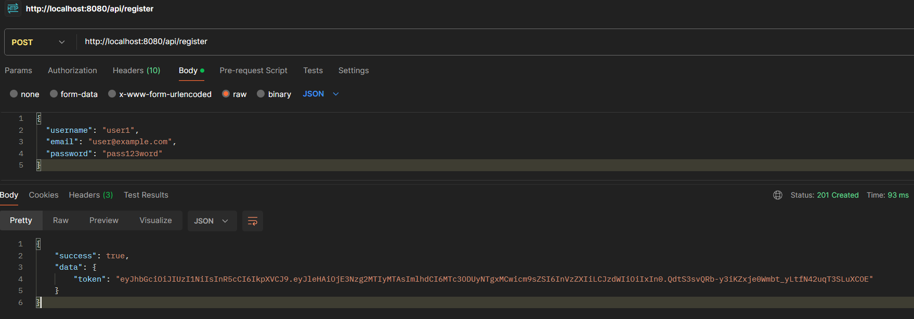
 
Успешный вход:
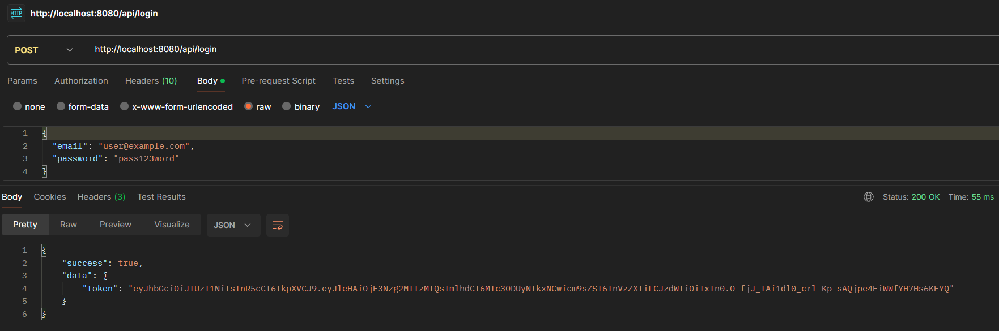
 
Создание счёта:
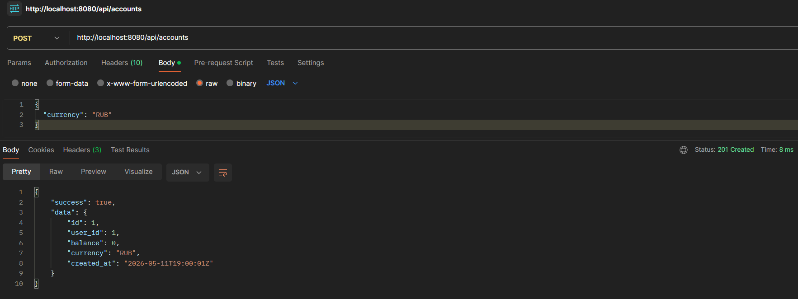
 
Выпуск карты:
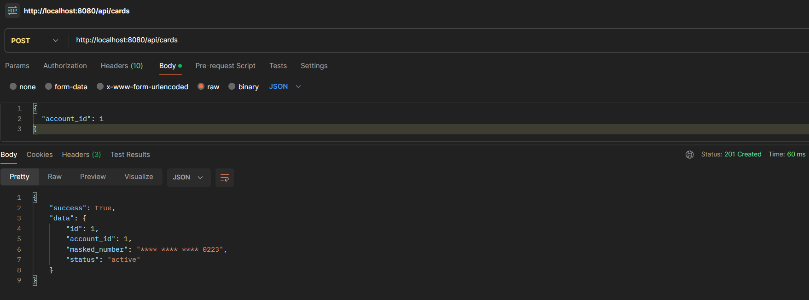
 
Оплата картой:
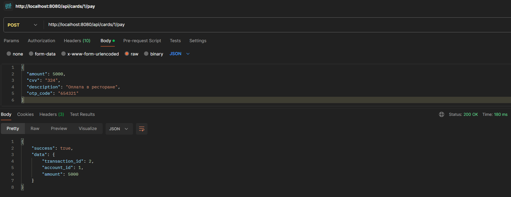
 
Перевод:
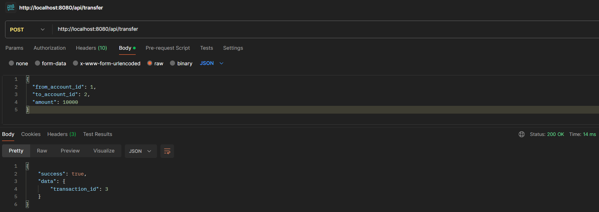
 
Оформление кредита:

 
Оплата кредита:
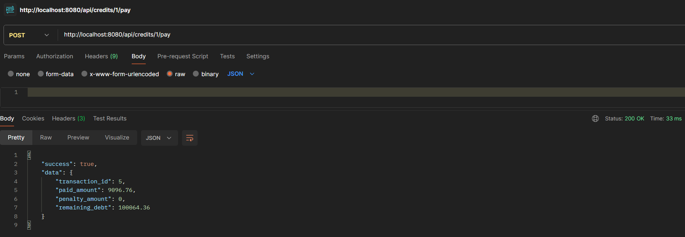
 
Доходы/расходы:
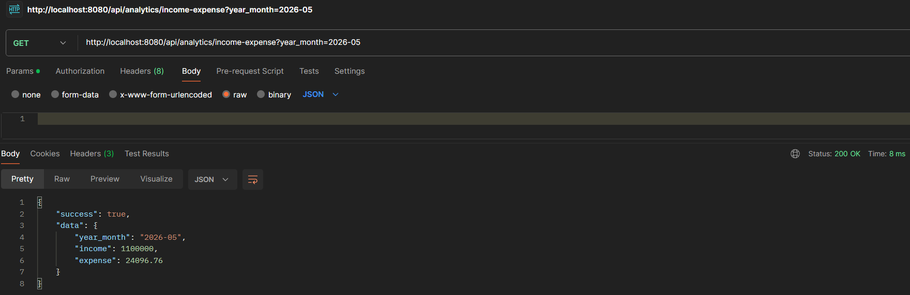
 
Кредитная нагрузка:
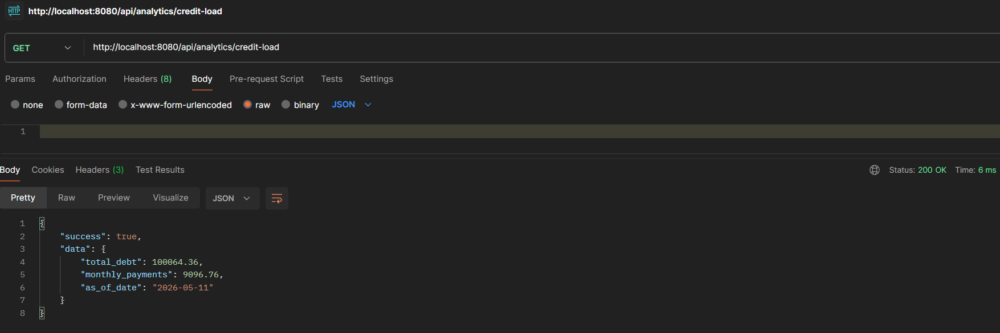
 
Список пользователей (админ):
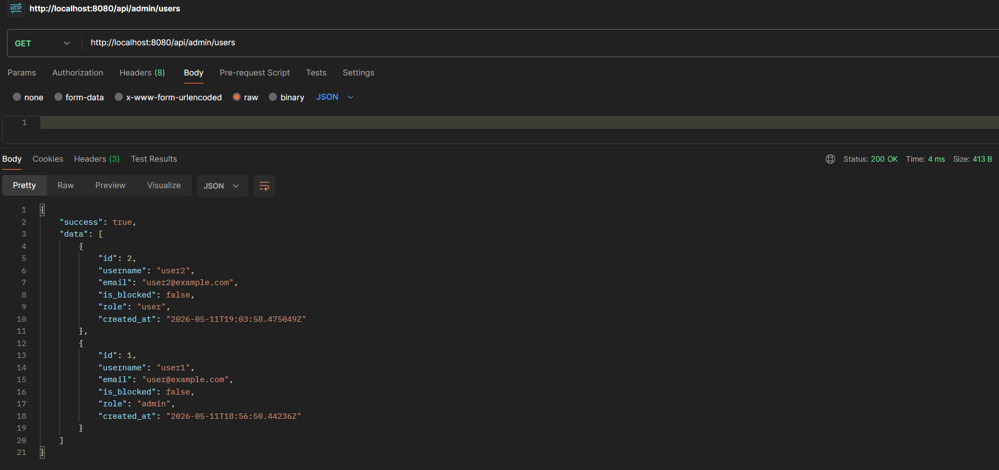
 
Ошибка:
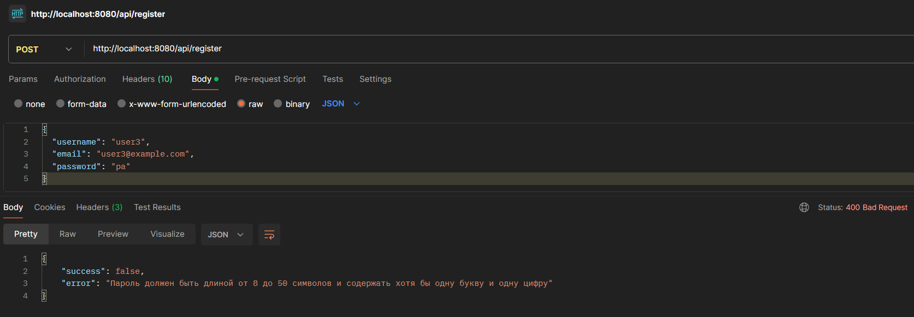
 

## Безопасность
Пароли пользователей хранятся в виде bcrypt-хэша.
 
Доступ к защищённым методам осуществляется по JWT в заголовке Authorization. В токене закодирован ID пользователя; после проверки подписи пользователь загружается из базы, учитывается состояние блокировки.
 
В случае данных банковских карт поля с реквизитами шифруются через PGP, для номера вычисляется HMAC для контроля целостности, CVV хранится в виде bcrypt-хэша. В операциях со счетами и картами проверяется, что текущему пользователю действительно принадлежат те счета и карты, с которых он хочет списать деньги. В случае кредитов проверяется, что операции инициирует получатель кредита.
 

## Тесты
Для проверки работоспособности проекта отправляйте HTTP-запросы на http://localhost:8080 с помощью Postman или аналогичной утилиты. Опирайтесь на данный README и openapi.yaml, чтобы определить, какие данные куда и как отправлять, а также получить готовые примеры тел запросов для тестирования.
 
При push и pull request в любую ветку выполняется workflow из .github/workflows/ci.yml. Выполняются установка Go, загрузка зависимостей и запуск команды go test ./... (проверка компиляции проекта).
 

## Логирование
Каждый HTTP-запрос подробно логируется при помощи logrus и middleware logging.go (указываются метод, путь, статус, длительность, время). Все ключевые события и ошибки сервисов записываются в консоль через logrus в формате JSON.
 
Пример логов:
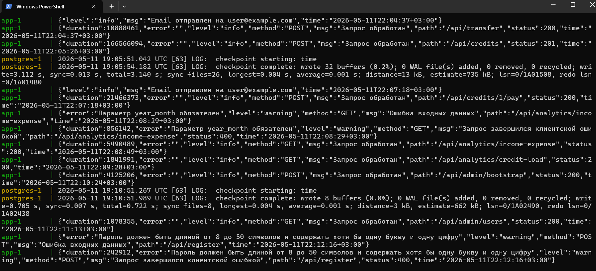

## Фоновая задача
Планировщик запускает обработку просроченных платежей каждые 12 часов. Планировщик реализован при помощи go-co-op/gocron/v2. Результаты и ошибки отражаются в логах приложения.

## Проверка двухфакторной аутентификации
После отправки запроса на /api/2fa/setup возьмите значение из поля secret из ответа и добавьте его в приложение Google Authenticator. Затем отправьте на /api/2fa/enable тело с текущим отображаемым в приложении кодом { "code": "123456" }. Если был передан правильный код, то включится двухфакторная аутентификация. Аналогично её можно отключить, отправив текущий код из приложения на /api/2fa/disable.
